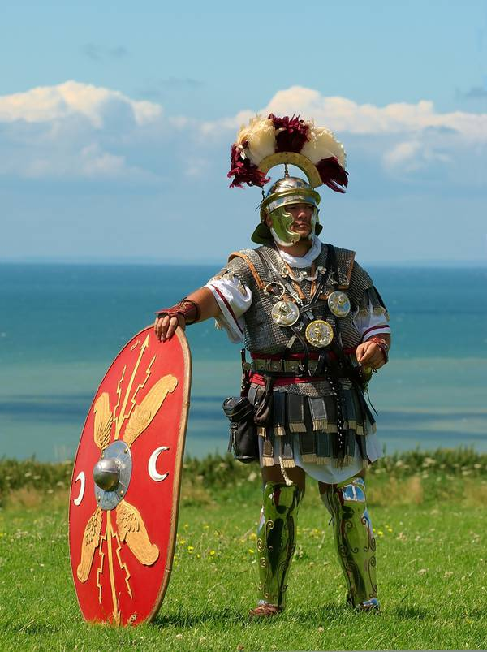
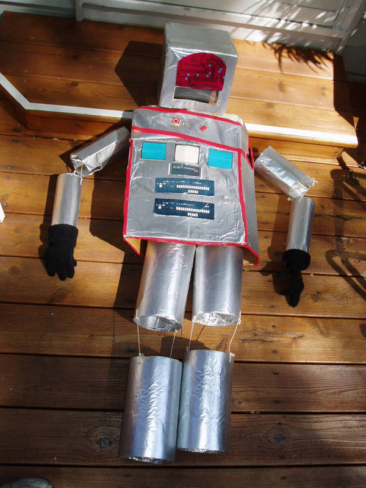

Title: Dreaming of Math
Date: 2014-10-02
Tags: personal, math, musings
Category: Personal
Template: article.longform

I love math.  I miss using math and can easily find myself engrossed in the solving of fun math problems.  Recently, I've been trying to sort out how to cut a flat sheet of paper such that you can bend it into a cone&mdash;specifically, given the radii of the top and bottom openings and the height, how do I draw that on a flat sheet.  I love that math is discoverable.[ref]Unlike some subjects, (English, for instanceI'm not disparaging English.  I love the subject and the language.) it's entirely possible to be given a math problem and figure it out without first being taught it.  There's nothing naturally discoverable about *and* being a conjuction&mdash;we've decided it should be thus and you must learn it.  Of course, in Mathematics there is a standard, agreed-upon *representation* which ought to be learned (and which is probably a big stumbling block for many people) but it's merely our representation for the already-existing thing.[/ref]

Because I love math, I have a secret dream of one day becoming a math teacher.  Any level or grade would be fun.  And while having willing students would be great, even the challenge of teaching the unwilling could be fun, too.  Thanks to the marvel of pregnancy and birth, Because our guinea pig gave birth. I will have at least two guinea pigs.  And having my own flesh and blood as students could be better since I don't have to worry about any imposed curriculum.

For instance, I would probably teach a lesson that went like this:

"Hello, children," I would say (as a way of beginning the class).  "Who can come up here and write the numbers 1 through 9 up here on the board?"  Hopefully, someone(s) would write them up.

> 1 2 3 4 5 6 7 8 9

And then I would say something like, "Now, if you had one piece of cake and I grabbed it, ran away and ate it all gone, how much cake would you have?  ... That's right: none!"I might even give a kid a real piece of cake just so I can steal it and say this with a mouthful of chocolate cake.  And then I would (with a flourish) write the number 0 up before the 1.  "Zero is a very important number," I might say.

"Now, who can come and write the number ten on the board?"  Some kid writes it up; now the board looks like this:

> 0 1 2 3 4 5 6 7 8 9 10

Just before the kid gets back to his seat, "Wait a second!  What are you trying to do?  Are you playing a trick on me?"  Maybe he'll stammer in confusion.  "I asked you to write the number ten on the board and you just put up a 1 and a 0.  We already have a 1 and a 0.  We need a ten."

Hopefully the class will protest: "But that is a ten!"

"Oh... is it?  Here is your first piece of homework," and I'll write on the board:

> Why is the number 10 written with two digits?  And why a 1 and a 0?

Then, I'd circle the numbers 0 through 9 and say, "These are digits.  Digits.  Digits are the letters of numbers.  Just like *c*, *a*, *k* and *e* are the letters that form *cake*, the digits *1* and *0* form the number *10*.  Here's your second and third assignments:

> How many numbers can you think of that only have one digit?

and

> How many numbers can you think of that have one or two digits?

I might ask them to write down this assignment... or find some other means of distraction so that I could quickly dress up in this costumeI think my classroom might have a phone booth in it just for things like this.:

"Ahoy!" I'd yell.  (Or perhaps I'd research the Romans and how they greet and say that instead).  Anyway, I'd make a noise and draw a sword.  "What mean ye to be doin'?" my Roman pirate self would say.  Roman pirates typically refer to chalkboards and whiteboards as "de plank.""What manner of scurvy be writin' this dross on de plank?"  I might peek out from under my helmet and loudly whisper, "IT'S OKAY.  I'M PRETENDING TO BE A ROMAN CENTURION."

"What is this?" I'd demand, pointing at the number *5*.  Hopefully they'd say, "It's a five!"

"No, no, no.  That's not a five.  *This* is a five."  And I would draw a big Roman numeral *V* on the board... maybe with a piece of chalk/marker stuck to the end of my sword.  "And what are all these?"  I'd point to each number and draw the *right* number above it.

> I II III IV V VI VII VIII IX X
>
> 0 1 2  3   4  5 6  7   8    9  10

"And... eh... what be this garbage?" pointing at the zero.  "It's a zero!  It's a zero!" they'd say.  "What's a zero?" I'd say.  "Forget that!  Anyway, these are the digitsThey're probably not technically digits, but I think it's an okay name for this purpose. we Romans use: I, V, X.  See if you can figure out how they work."

I'd need another distraction at this point.  Perhaps I could get the principal to come in so that I could stab him with my sword.  He would die a great, dramatic death over the course of a few minutes&mdash;the kids would love it.  In the meantime, I'd get dressed up as this:

"Beep, beeoop!" I'd say in a robot voice.  "I only know ones and zeroes.  Beeowwoop!  Ones and zeroes are all I know."  I'd maneuver to the board and say, "These are all wrong.  This is the correct way to write the numbers 0 through 10."  It would end up looking like this:

> I II III IV V VI VII VIII IX X
>
> 0 1 2 3 4 5 6 7 8 9 10
>
> 0 1 10 11 100 101 110 111 1000 1001 1010

I'd leave then return as my normal self.  "Well that was interesting.  What did you all think of how the Roman and robot write numbers?"  (possibly crickets, but hopefully someone will say *something* that we can talk about).

"Let's ignore the Romans for now.  Look at these two," I'd circle the *10*s on both bottom lines.  "We call this ten but the robot calls this two.  How is that possible?  How does the robot's system for writing numbers work?"  That's another assignment:

> How does the robot system work?  How would the robot write 13?

And finally I would draw three simple pictures on the board:[ref]Speaking of pictures: when it comes time to use variables in mathI actually had a college professor use a kitty cat for a differential equation variable: "Kitty cat d kitty cat.", instead of using *x* and *y* I'm going to start with names like *Secret Number* and *Bob* then move to pictures like these.  Then let the student naturally get tired of writing so much and suggest we just use short names like *x* and *y*.[/ref]

> &#x2603; &#x26A1; &#x2693;

You next to last assignment is to:

> Make a code for writing numbers using these three pictures.  How would you write the numbers 0 through 10?  Take inspiration from the robot system if you want.

And finally, I'd give this last assignment:

> Why are there 10 digits?  Does the number 10 appear anywhere in nature?  Look up *digits* in the dictionary.

Then I'd give them time to work on the problems.  I would meander about the classroom and try to get the puzzle into their heads so they would work it out.

Man, that would be fun.  Oh, and when it comes time for equations... but that's for another post.