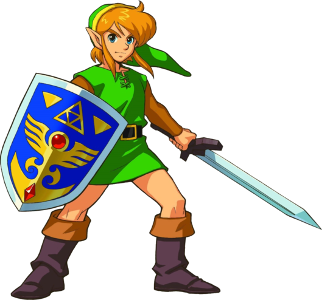

Title: Good things come in small packages
Date: 2015-01-23
Tags: dev,gaming
Template: article.longform

I hope the following picture (credit to [Zeldapedia](http://zelda.wikia.com/wiki/The_Legend_of_Zelda:_A_Link_to_the_Past_characters)) takes a noticeable time to load in your browser:

We bought a new washing machine a few weeks ago.  The [sound the washer makes when you turn it on](https://www.youtube.com/watch?v=6WecOTi8ynA&t=4m20s) sounds an awful lot like the [sound *A Link to the Past* makes when you turn it on](https://www.youtube.com/watch?v=iC0KIrKIEYM&t=11s).  So my washing machine has been suggesting that I play *A Link to the Past*.  And I've learned that when your washing machine makes noises, you should listen :)

I installed [ZSNES](http://www.zsnes.com/) and then found a place to get the ROM.  I downloaded it and a second later I... wait, a second?  It took a mere second to download the game?  A second to download one of the greatest video games ever made, including the fun graphics, great music, engaging plot and many puzzles&mdash;things responsible for hours of my childhood entertainment.

So how big is the *Link to the Past* ROM?  1MB.  Almost exactly as big as that image up above.  In a world where [addictive](https://itunes.apple.com/us/app/candy-crush-saga/id553834731?mt=8) and [terrible](https://itunes.apple.com/us/app/xenon-worst-game-ever/id869401794?mt=8) games are 20x the size, and [beautiful blockbusters](https://itunes.apple.com/us/app/monument-valley/id728293409?mt=8) are 250x bigger, I had to pinch myself and verify that, in fact, this old immersive gem is really smaller than most photos.

It reminds me that you can achieve a lot with a little.
